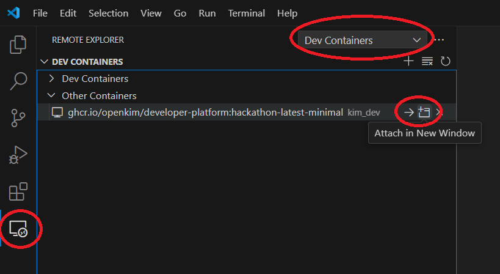

# KIM Developer Platform

## Background
The KIM Developer Platform (KDP) is a docker container image that provides a
preconfigured linux environment for interactively compiling and executing
tests, verification checks, models, and simulator models from
[OpenKIM](https://openkim.org) against one another just as they would run
inside of the OpenKIM Processing Pipeline [[1](#references)]. This includes a
gcc compiler toolchain, molecular simulation software (LAMMPS and ASE), and a
convenient set of command line utilities that are adapted to the structure of
OpenKIM content.  The resulting environment is useful for anyone planning on
developing content to submit to OpenKIM, wants to run KIM
verification checks to validate the integrity of their own models, or simply
wants a containerized software stack that is pre-configured to run KIM models.

A short tutorial on using the KIM Developer Platform can be found at
[https://openkim.org/doc/evaluation/kim-developer-platform/](https://openkim.org/doc/evaluation/kim-developer-platform/).

Feedback and bug reports are welcome and may be posted on the
[matsci.org/openkim](https://matsci.org/openkim/) forum or submitted to
[support@openkim.org](mailto:support@openkim.org).

### Using other container systems (Singularity/Apptainer, Podman, etc.)

The detailed instructions below are specifically for Docker. Through the [Open Container Initiative](https://opencontainers.org/), 
images created for Docker are interoperable with other container systems such as 
[SingularityCE](https://sylabs.io/singularity/)/[Apptainer](https://apptainer.org/) (two
forks of the Singularity project) and [Podman](https://podman.io/). Unlike Docker, these systems
do not require root access, and are therefore more commonly installed on HPCs.

Podman operation is largely analogous to Docker operation, although the mapping of host users
to users inside the container may create some issues with mounted directories.

Singularity operates significantly differently from Docker, as it inherits the host user. This makes it more difficult
to use the custom command-line utilities provided with the KDP (`kimitems`, `pipeline-run-pair` etc.) and described
in the tutorial (documentation coming soon). However, using the KDP as a software environment for your own calculations
is fairly straightforward using Singularity. For example, suppose you wish to run a LAMMPS simulation with the 
MACE-MP-0-a model [TorchML_MACE_BatatiaBennerChiang_2023_MP0a_medium__MO_568776921807_000](https://openkim.org/id/TorchML_MACE_BatatiaBennerChiang_2023_MP0a_medium__MO_568776921807_000)


### Installing Docker

The KIM Developer Platform is distributed on the Github Container Registry as
a docker image.  In order to use it, you will need to install docker.  See
[https://docs.docker.com/get-docker/](https://docs.docker.com/get-docker/) for
instructions on installing Docker Desktop for your OS.  If using macOS or
Windows, remember to start the Docker Desktop application before attempting to
use any `docker` commands.

### Terminology

The two main concepts of docker are "images" and "containers".  An image is
essentially a file system containing a minimal operating system and associated
program and data files, and can either be constructed locally or retrieved from
a remote registry such as DockerHub or the Github Container Registry by doing
[`docker pull`](https://docs.docker.com/engine/reference/commandline/pull/).
Containers, on the other hand, should be thought of as specific instantiations
of images.  They amount to taking the file system comprising the image and
adding another layer on top of it in which new files can be created or existing
files edited, then running a process within that layer.  Containers are
typically created from images using the [`docker run`](https://docs.docker.com/engine/reference/commandline/run/)
command and passing the name of a specific image and command to run as
arguments.

After installing docker on your system, it will create a local image repository
that can be viewed by issuing [`docker images`](https://docs.docker.com/engine/reference/commandline/images/),
while all of the containers created from your local images can be viewed with
[`docker ps -a`](https://docs.docker.com/engine/reference/commandline/ps/) (the
`-a` flag means to list all containers, even those which are not currently
running).  You can view the size of the containers you have created by doing
`docker ps -as`.

## Images hosted in this repository

There are two images published with each release of the KDP: a "full" image and
a "minimal" image.  The former image contains all of the packages necessary to
run all KIM tests and verification checks, while the latter includes a set of
packages sufficient to run most of them but not all.  In particular, the
biggest difference at the moment is that the full image contains an
installation of [OVITO](https://www.ovito.org/), which doubles the uncompressed
size of the image from roughly 1.04GB ➝ 2.04GB; this package is currently only
used to run the dislocation tests, so for most users the minimal images will
suffice.

## Installing the KIM Developer Platform

Once docker is installed, there are two remaining steps in setting up the KIM
Developer Platform: (1) pulling one of the images hosted in this repository,
and (2) spawning a container from the image.  As mentioned above, the former is
accomplished using `docker pull`, while the latter can be done with `docker
run`.  If you want the latest minimal image, you must explicitly specify a
corresponding docker tag ending in '-minimal' (replacing `kim_dev` with
whatever name you wish to use for the container on your system):
```
docker pull ghcr.io/openkim/developer-platform:latest-minimal
docker run -it --name kim_dev ghcr.io/openkim/developer-platform:latest-minimal bash
```
Alternatively, if you want the full image, do this:
```
docker pull ghcr.io/openkim/developer-platform
docker run -it --name kim_dev ghcr.io/openkim/developer-platform bash
```
*NOTE:* If you wish to install and use JupyterLab to work in your container (see section regarding IDEs at the bottom of the page), you must expose a port by e.g. adding the argument `-p 8888:8888` to your `docker run` command.

The container will automatically stop when you close the original bash session
that was opened by doing `docker run` above; this can be verified by doing
`docker ps`, which will reveal no running containers.  This will *not* cause
any of the data you created or modified in the container since creating it to
be lost.

The next time you want to use the container (which now already exists, having
been previously created by `docker run`), you can do [`docker start -ai kim_dev`](https://docs.docker.com/engine/reference/commandline/start/)
to start a new bash session.  Additional shell sessions can be opened to a
running container from other terminals by doing [`docker exec -it kim_dev bash`](https://docs.docker.com/engine/reference/commandline/exec/).
Exiting a shell session that was initiated with `docker start -ai` will stop
the container, even if other shell sessions are active.  If you do not want
this behavior, you can choose to only use the `docker exec -it kim_dev bash`
method to open shell sessions; if you do things this way, then you will need to
explicitly stop the container with `docker stop kim_dev`.  Stopping a container
will not cause you to lose the container or any of the files inside (use
`docker rm kim_dev` to delete the container, but be warned that this means you
will lose all of the files you have created or modified inside of the container
since it was first made using `docker run`; see below).

## Sharing files with the host

In order to avoid losing files in a container when deleting it, the [`docker cp`](https://docs.docker.com/engine/reference/commandline/cp/)
command can be executed from your host machine to copy files from the container
onto your host machine or vice versa.  However, repeating this time and time
again can become tedious.  Therefore, two additional mechanisms for sharing
files between a host and a container exist in docker: "bind mounts" and
"volumes".  Both of these exist independently of any container and, thus, even
if a container they are attached to is deleted, their contents are safe.  A
bind mount is an explicit mounting of a directory on the host machine to a
directory inside of a container, and must be done at the time a container is
first created from an image using `docker run`.  For example, to mount the
directory at /home/user/Documents/my_kim_stuff on the host to a directory
called /home/openkim/kim-dev inside of a container, one could instantiate it
via
```
docker run -it --name kim_dev --mount \
    type=bind,source=/home/user/Documents/my_kim_stuff,target=/home/openkim/kim-dev \
    ghcr.io/openkim/developer-platform
```
Unlike bind mounts, docker volumes are managed internally by docker, and thus
are not readily visible on the host.  The syntax for mounting a directory in a
volume to a directory inside a container is the same as for bind mounts, only
with "type=bind" omitted.

*NOTE:* Because the namespace of the container is isolated from the host at the
time of its creation, there is no (easy) way to attach a volume or mount a
directory to a container that has already been created.

*NOTE:* On Windows hosts, where the host file system is very different from
that of linux, volumes are far preferred to bind mounts.

For more information, see:

- https://docs.docker.com/storage/bind-mounts/
- https://docs.docker.com/storage/volumes/

## Installing additional packages

This image is based on [ubuntu](https://hub.docker.com/_/ubuntu), and so
additional packages can be installed using apt-get.  For example, if you prefer
not to use the vim editor bundled on the container, you can install emacs
via:
```
$ sudo apt-get update
$ sudo apt-get install emacs
```
(the sudo password for user 'openkim' is 'openkim').  Be sure to execute
`apt-get update` first in order to build the apt cache, which is not included
in this image.

## Allocating system resources

On macOS and windows, if you start Docker Desktop and open its settings page,
there is a "Resources" tab that allows you to specify how many CPU cores, memory,
swap space, and disk you want to reserve for Docker to use.  Options for controlling
resource allocation on a container-by-container basis can be found at
https://docs.docker.com/config/containers/resource_constraints/.  In linux, resource
control must be done on a container-by-container basis.

## IDEs (VSCode and Jupyter Lab)

To work inside the container using VSCode, you can use the "Dev Containers"
extension. Select "Remote Explorer" in
the left sidebar, then choose "Dev Containers" in the drop down menu. Your
container should be under "Other Containers", and you can attach VSCode to it
using one of the icons on the right. See image below with relevant UI elements:



Once you have attached VSCode to your container once, it will appear under 
"Dev Containers" rather than "Other Containers".

To use Jupyter Lab to access the container, you must have issued your `docker run` command
with the option to expose a port (e.g. `-p 8888:8888`). Then, you can install Jupyter Lab using
```
sudo pip install jupyterlab
```
It is a large installation, so we do not include it as not all users will need it. Then you can use JupyterLab by running

```
jupyter lab --ip 0.0.0.0
```
inside the container, or from your host terminal by running 
```
docker exec kim_dev jupyter lab --ip 0.0.0.0
```
where `kim_dev` should be replaced if you named your container something different.
You should now be able to access the Jupyter Lab IDE inside your container by
pointing your browser at one of the displayed URLs (typically the one starting with `http://127.0.0.1:8888/lab?token=`).


## References

[1] "The OpenKIM Processing Pipeline: A Cloud-Based Automatic Materials
Property Computation Engine", D. S. Karls, M. Bierbaum, A. A. Alemi, R. S.
Elliott, J. P. Sethna and E. B. Tadmor, *Journal of Chemical Physics*, 153,
064104 (2020). [doi](http://dx.doi.org/10.1063/5.0014267)
