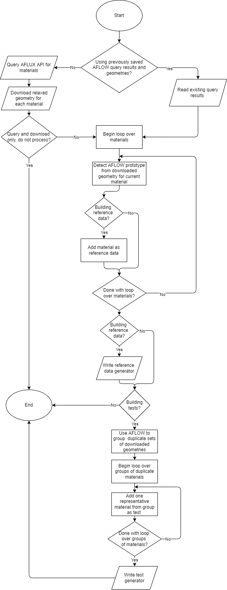

.. _doc.testgen:

===================================================
Building and posprocessing tests and reference data
===================================================

The main script for generating tests and reference data is :mod:`build_tests_refdata_from_aflow`. Details of its operation, including the input parameters and files can be found in its linked module documentation. This script outputs reference data generators and test generators for each alloy into the directories ``alloy_refdata_generators`` and ``alloy_test_generators``. Their formats can be found here:
    
    * :ref:`doc.refdata_gen_format`
    * :ref:`doc.test_gen_format`

Below is a flowchart overview of the main loop of the script, one iteration for each species combination:

Rendering of generators into tests and reference data
-----------------------------------------------------

Generators must be processed by the ``kimgenie`` utility to generate tests and reference data in the `KIM Development Platform (KDP) <ttps://openkim.org/doc/evaluation/kim-developer-platform/>`_. Generators should be concatenated into the files ``test_generator.json`` and ``refdata_generator.json`` in the main test driver directory (``EquilibriumCrystalStructure__TD_457028483760_002``). 

In order to generate tests, copy the main test driver directory into ``/home/openkim/test-drivers/``, then run:

.. code-block:: bash
    
    kimgenie tests --test-driver EquilibriumCrystalStructure__TD_457028483760_002

In order to generate reference data, from inside the main test driver directory, run:

.. code-block:: bash
    
    kimgenie ref-data .

This will render the tests and data into  ``/home/openkim/tests/`` and  ``/home/openkim/reference-data/``.
